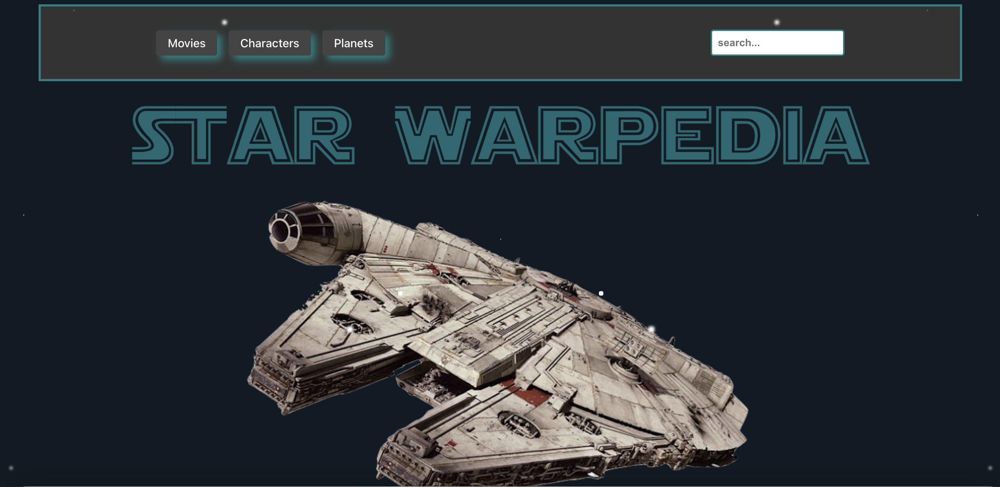
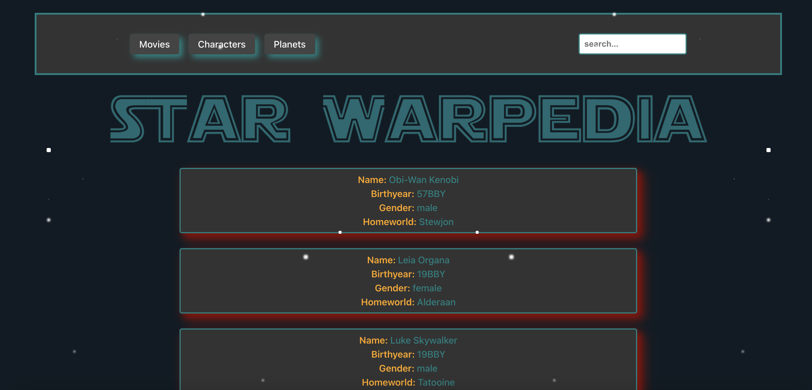

# Project Star Wars 🪐

# Star Warpedia

Welcome to Star Warpedia, the ultimate Star Wars information hub! This project allows users to fetch detailed information about Star Wars movies, characters, and planets using an intuitive and interactive interface.

## Features

- Movies: Access detailed information about all Star Wars movies.

- Characters: Explore the fascinating details of various Star Wars characters.

- Planets: Learn about the different planets in the Star Wars universe.

- Search Functionality: Use the search input field to quickly find specific movies, characters, or planets.

* A little galaxy animation might catch your eye ✨

## Navigation

Users can navigate through the information using buttons in the navbar or by utilizing the search input field within each section. The user-friendly design ensures that Star Wars fans can easily find the information they seek.

## Technologies Used

- Vite: Fast and efficient build tool for modern web projects.

- HTML: The backbone structure of the application.

- CSS: Styling the application, including the galactic-themed design.

- TypeScript: Ensuring type safety and enhancing JavaScript with additional features.

## API

This project fetches data from the Star Wars API (SWAPI), providing real-time and comprehensive information about the Star Wars universe.

## Design

The design of Star Warpedia was created spontaneously to capture the essence of the Star Wars universe, with thematic elements that will remind fans of a certain iconic character. The dark and mysterious ambiance, combined with teal highlights and shadow effects, creates an immersive experience for users.

## Here's a little preview ...

## Try it out here : [Starwarpedia](https://project-star-wars-wd2403.netlify.app/#)
